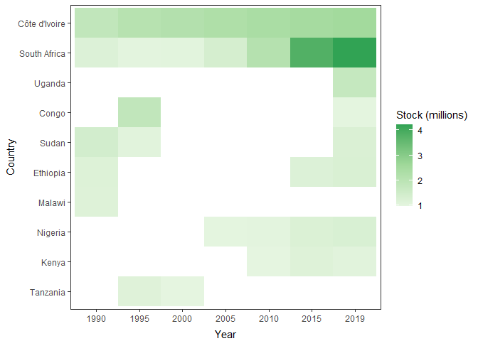
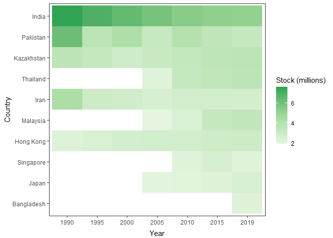
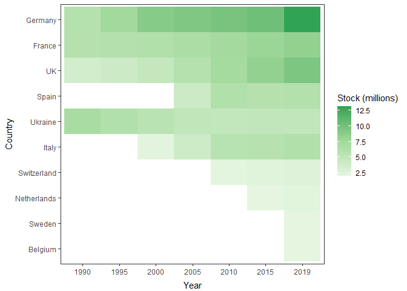
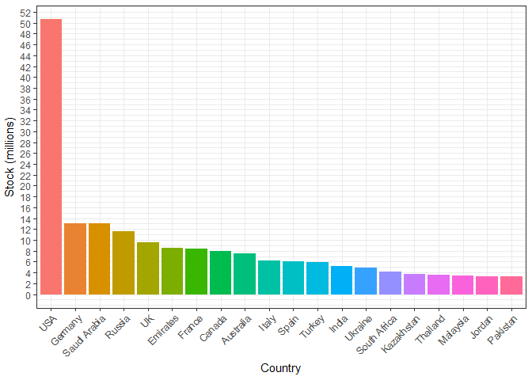

International Migrant Stocks 1990-2019
================

### Overall

<!-- -->

### Overall (cummulative)

<!-- -->

### Select European Countries

<!-- -->

### Select European Countries (cummulative)

<!-- -->

### Africa (top 10)

<!-- -->

### Asia (top 10)

<!-- -->

### Europe (top 10)

<!-- -->

### World (2019, top 20)

Only showing countries with stock higher than 1 million.

<!-- -->

Source: United Nations, Department of Economic and Social Affairs.
Population Division (2019). International Migrant Stock 2019 (United
Nations database, POP/DB/MIG/Stock/Rev.2019)
