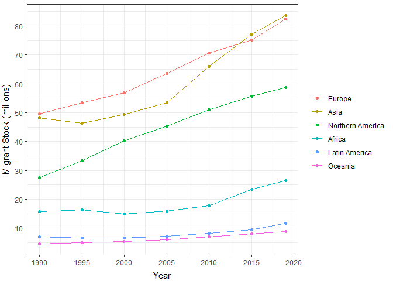
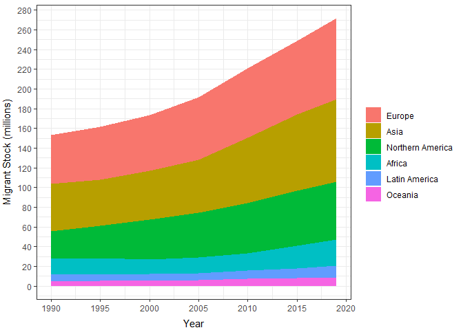
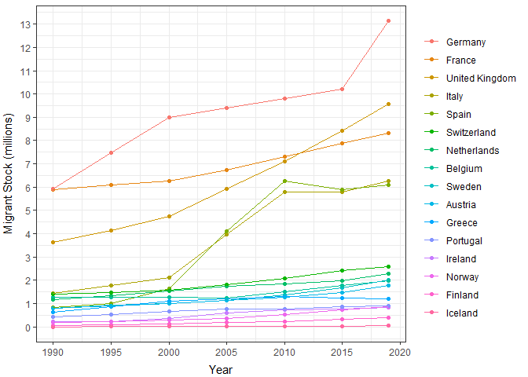
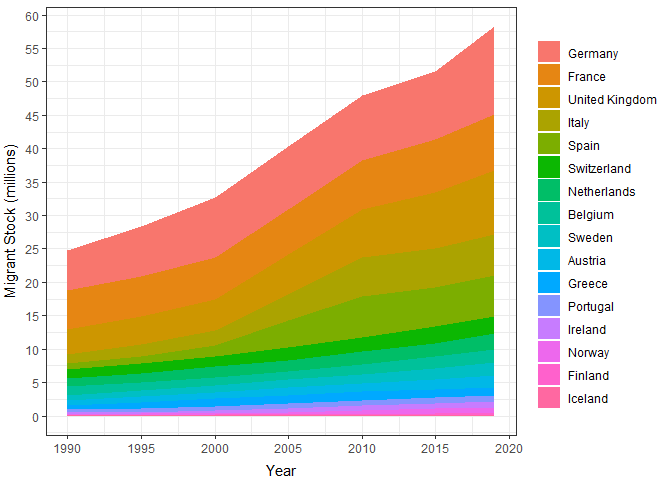

International Migrant Stocks 1990-2020
================

### Overall

<!-- -->

### Overall (cummulative)

<!-- -->

### Select European Countries

<!-- -->

### Select European Countries (cummulative)

<!-- -->

Source: United Nations, Department of Economic and Social Affairs.
Population Division (2019). International Migrant Stock 2019 (United
Nations database, POP/DB/MIG/Stock/Rev.2019),
<https://www.un.org/en/development/desa/population/migration/data/estimates2/estimates19.asp>
